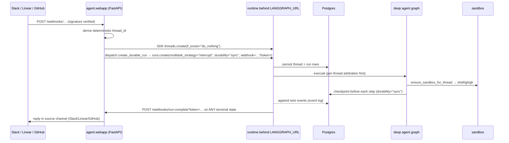
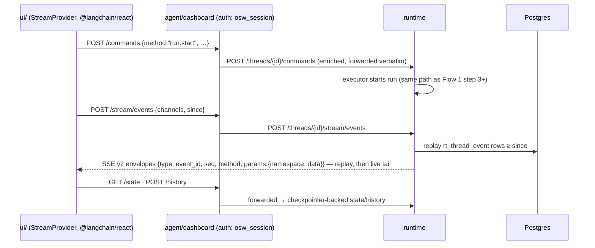

# End-to-end flow: before (`langgraph dev` / langgraph-api) vs now (`agent_runtime`)

**Scope.** How a request travels through the system — trigger → webapp → runtime →
executor → Postgres → SSE → UI — on `main` (Elastic-licensed `langgraph-api`
behind `langgraph dev`/`langgraph up`) and on `feat/fastapi-runtime` (MIT
`agent_runtime/` behind plain uvicorn). The application layer (`agent/`, `ui/`)
is deliberately unchanged; what changed is everything behind `LANGGRAPH_URL`.

---

## The topology, before and after

Both worlds are a **single process** in dev, with the FastAPI webapp living
*inside* the runtime server and `LANGGRAPH_URL` pointing back at the same
socket. What flipped is who owns the front door:

| | Before (`main`) | Now (`feat/fastapi-runtime`) |
|---|---|---|
| Boot command | `make dev` → `uv run langgraph dev` | `make dev` → Docker Postgres + `uvicorn agent_runtime.app:app --reload` |
| Front process | `langgraph-api` server (Elastic-2.0, from `langgraph-cli[inmem]`) | `agent_runtime/app.py` (FastAPI, MIT-only closure) |
| Webapp mounting | `langgraph.json` `http.app: agent.webapp:app` — langgraph-api mounts the webapp into itself | `app.py:172-176` — agent_runtime registers its routers first, then mounts `agent.webapp:app` at `/` as a catch-all (Starlette matches in registration order, so runtime paths win; webhooks/dashboard/OAuth fall through) |
| Dev persistence | `langgraph-runtime-inmem`: in-memory checkpointer, store, and run queue | One Postgres for everything: MIT `AsyncPostgresSaver` (checkpoints), `AsyncPostgresStore` (store), plus agent_runtime's four owned tables `rt_thread` / `rt_run` / `rt_cron` / `rt_thread_event` (`agent_runtime/schema.sql`; see "The four owned tables" under Flow 3) |
| Prod persistence | `langgraph up`: Postgres + Redis + durable queue + worker pool | Same single Postgres; single process enforced by a `pg_try_advisory_lock` at boot (`app.py:43-71`) |
| Run execution | Durable queue; workers poll and pick up runs; interrupted runs auto-resume | `asyncio.create_task` in-process (`executor.py`); no durable queue; a 500ms pickup delay (`AGENT_RUNTIME_PICKUP_DELAY_MS`) models the old queue's latency |
| Streaming fanout | Broker (in-mem queue in dev / Redis on platform), SSE replay + tail | Durable event log in `rt_thread_event` + in-process fanout (`streams.py`), SSE replay-then-tail with seq/ord dedupe |
| Crons | Platform scheduler inside langgraph-api | APScheduler + Postgres-persisted crons (`cron_scheduler.py`) |
| `.env` handling | `.env` overrides the shell | Shell wins (`load_dotenv(override=False)`, `app.py:149-155`) |

---

## Flow 1 — a trigger becomes an agent run (Slack mention, Linear comment, GitHub PR comment)

This flow's *edges* are identical in both worlds up to the runtime boundary;
only the box behind `LANGGRAPH_URL` changed.

Step by step, with where each hop lives:

1. **Webhook in.** GitHub/Linear/Slack POST to routes on `agent/webapp.py` /
   `agent/webhooks/*`. Signatures verified
   (`utils/github_comments.py:verify_github_signature` etc.). A deterministic
   `thread_id` is derived so follow-ups land on the same thread.
2. **Dispatch.** Every trigger funnels through the single contract
   `agent/dispatch.py:create_durable_run` → `client.runs.create(...)` with
   `multitask_strategy="interrupt"`, `durability="sync"`,
   `if_not_exists="create"`, and a completion `webhook` URL carrying a
   verification `?token=`. The SDK call is plain HTTP back into the same
   process (`LANGGRAPH_URL` → same socket).
3. **Runtime accepts the run.**
   - *Before:* langgraph-api wrote the run into its **durable queue**; a
     worker later polled it up. Multitask arbitration, checkpointing, and
     stream publication were internal to the licensed server.
   - *Now:* `agent_runtime/routers/runs.py` → `RunExecutor`
     (`agent_runtime/executor.py`). A per-thread `asyncio.Lock` arbitrates
     multitask (`interrupt` halts the active run at its last sync checkpoint
     and starts the new one with full history; `reject` refuses; `rollback`/
     `enqueue` are not implemented → HTTP 400). After a deliberate ~500ms
     pickup delay (models the old queue latency — load-bearing for Slack
     follow-up coalescing), the run executes as an `asyncio.create_task`.
4. **Graph execution.** The executor resolves the graph factory from
   `langgraph.json` via `agent_runtime/registry.py` (same
   `get_agent`/`get_reviewer_agent`/… factories as before), attaches the
   shared `AsyncPostgresSaver` as the compiled checkpointer, and iterates
   `graph.astream(..., subgraphs=True, durability="sync")`. Checkpoints land
   in Postgres **before** each step — same guarantee as before, now via the
   MIT checkpointer.
5. **Mid-run messages** (unchanged app mechanics): a new Slack/Linear message
   for a busy thread is queued in the store; `check_message_queue_before_model`
   middleware drains it into the conversation before the next model call. The
   arbitration + pickup delay preserve the coalescing window the platform
   queue used to provide (pinned by the `slack_debounce` e2e).
6. **Completion.** On *every* terminal state (success, error, cancel, orphan
   sweep) `agent_runtime/webhooks.py` POSTs the run payload to
   `COMPLETION_WEBHOOK_URL?token=…` → `agent/completion.py` verifies the token
   and posts the Slack/Linear/GitHub reply. Before, langgraph-api's webhook
   feature did this POST; the payload fields the app reads (`status`,
   `thread_id`, `run_id`) are contract-identical.

**The one semantic change in this flow:** crash recovery. Before, an in-flight
run survived a process restart — the durable queue re-picked it up and it
auto-resumed. Now there is **no durable queue and no auto-resume** (D3): on
the next boot `executor.sweep_orphans_on_boot()` marks orphaned runs `error`
and fires exactly one failure webhook, so the user is told and must
**re-trigger**; the re-triggered run resumes from the last sync checkpoint, so
no work is lost — but it doesn't continue on its own. (Chaos suite pins this:
`tests/chaos/`.)

---

## Flow 2 — the dashboard UI (browser → SSE and back)

The browser never talks to the runtime directly; everything goes through the
dashboard proxy in `agent/dashboard/thread_api.py` (and `review_chat_api.py`),
which owns auth (the `osw_session` cookie from GitHub OAuth) and then forwards
to `LANGGRAPH_URL`. This proxy layout is identical in both worlds.

- **Send:** the UI's `StreamProvider` submits via `run.start` on
  `POST /threads/{id}/commands`. Now handled by
  `agent_runtime/routers/commands.py` — which implements **only**
  `run.start`; any other v2 method (e.g. the SDK's native `input.respond`
  interrupt-answer) returns `invalid_argument`. The old server accepted the
  full v2 method set. The open-swe UI doesn't use `respond()` today (resumes
  go through `run.start`), so this is latent, not live.
- **Receive:** token chunks and value updates flow as v2 envelopes over SSE.
  - *Before:* langgraph-api's broker produced the v2 stream.
  - *Now:* the executor normalizes each `astream` item into a `WireEvent`
    (`agent_runtime/streams.py`), **persists it to `rt_thread_event`** (the
    durable event log), and fans it out in-process to live SSE subscribers.
    Reconnects resume via body `since` (v2) or `Last-Event-ID` (SDK stream
    endpoints, redis-style `<ms>-<n>` ids) — replay from Postgres, then tail.
    The Phase-0 golden transcripts recorded from `langgraph dev` are the wire
    spec (`tests/contract/golden/`).
- **Known wire gap:** the v2 envelope's `params.namespace` is currently
  hardcoded to `[]` (`streaming.py:49` calls `to_v2_envelope(event)` without a
  namespace even though the executor streams `subgraphs=True`), so
  subagent-scoped events can't be attributed by the UI's `SubagentActivity` /
  `useToolCalls(stream, {namespace})`. Untested by the parity suite (the only
  stream golden has no subgraph events). See "Regressions" below.
- **State/history:** `GET /threads/{id}/state` and `POST /threads/{id}/history`
  are served from the MIT checkpointer (`aget_state` / state history) instead
  of langgraph-api's internal implementation; shapes are golden-pinned.

---

## Flow 3 — data at rest

| Data | Before | Now |
|---|---|---|
| Threads + metadata | langgraph-api internal tables (inmem in dev) | `rt_thread` (JSONB metadata, `@>` search with nested keys, status, sort, select) — `threads_repo.py` |
| Runs | internal queue + run tables | `rt_run` — `runs_repo.py` |
| Stream events | broker (ephemeral in dev; Redis on platform) | `rt_thread_event` — durable, is *the* replay source |
| Checkpoints | langgraph-api checkpointer (inmem dev / Postgres platform) | MIT `AsyncPostgresSaver`, attached as the compiled checkpointer |
| Store (profiles, team settings, plans, queues, feedback state…) | langgraph-api store; in-graph `get_store()` and HTTP `/store` hit the same store | MIT `AsyncPostgresStore` — **one instance** shared by the HTTP router and in-graph `get_store()` (identity-tested) |
| Crons | platform scheduler state | Postgres-persisted, fired by APScheduler (`cron_scheduler.py`); one-shot thread wakeups use `end_time` |
| TTL | `langgraph.json` `checkpointer.ttl.strategy="delete"` (would drop whole threads; a no-op under dev's inmem) | `ttl_sweep.py`: deletes checkpoint data + events, **keeps** `rt_thread`/`rt_run` (thread metadata is load-bearing app state) — a swept thread reads like a never-run thread |

### The four owned tables (`agent_runtime/schema.sql`)

These are the only tables agent_runtime defines itself (Phase 1 D4 names,
binding across the phase docs). The checkpoint tables (`checkpoints`,
`checkpoint_blobs`, `checkpoint_writes`) and the store tables are created by
`langgraph-checkpoint-postgres`'s own `.setup()` and are deliberately **not**
in `schema.sql` — agent_runtime never hand-writes SQL against them (the TTL
sweep goes through `saver.adelete_thread`). The schema is applied idempotently
in the app lifespan (`CREATE TABLE IF NOT EXISTS`, plus additive
`ALTER TABLE ... ADD COLUMN IF NOT EXISTS` migrations — pre-production
"migration-lite", no migration framework).

**`rt_thread`** — one row per conversation thread; what langgraph-api kept in
its internal thread tables. `thread_id UUID` PK, `status` (`idle` / `busy` /
`interrupted` / `error`), `metadata JSONB`, `"values" JSONB` (final checkpoint
values, refreshed at each run's terminal step), timestamps. `metadata` has a
GIN `jsonb_path_ops` index because thread search is `@>` containment with
nested keys — this is what `reconcile.py`'s `status="busy"` search and the
dashboard thread list run against. Two things are load-bearing here:

- `status` is **derived, never stored ad hoc** — `threads_repo.py`'s single
  `recompute_status(thread_id)` is the only place transitions happen (`busy`
  if any run is pending/running; else `interrupted` if the latest run was
  interrupted or a checkpoint holds a pending interrupt; else `error`; else
  `idle`). Golden-pinned.
- `metadata` is the app's KV record for the conversation — sandbox id,
  encrypted GitHub token, Slack/PR links. This is *why* the TTL sweep keeps
  the row (Flow 3's divergence): dropping it would sever the thread from its
  sandbox and auth, not just its history.

**`rt_run`** — one row per run; replaces langgraph-api's run table *and* its
durable queue (a run's whole queue life is just this row's `status`:
`pending` → `running` → `success` / `error` / `interrupted` / `timeout`).
`run_id UUID` PK, `thread_id` FK (`ON DELETE CASCADE`), `assistant_id` (which
`langgraph.json` graph to resolve), `multitask_strategy`, `kwargs JSONB` (the
verbatim create-payload: input, config, `durability`, and the completion
`webhook` URL the terminal step POSTs to), `error TEXT` (additive migration).
Indexed on `(thread_id, status)` — the arbitration and `recompute_status`
query. The boot-time orphan sweep is a single `UPDATE` here: `pending`/
`running` rows from a dead process → `error`, one failure webhook each
(Flow 1's "no auto-resume" semantic change, Phase 1 D2).

**`rt_cron`** — Postgres persistence for what used to be platform scheduler
state (Flow 4). `cron_id UUID` PK, `assistant_id`, **nullable** `thread_id`
(NULL = schedule cron, fresh thread per fire; set = `crons.create_for_thread`,
i.e. thread wakeups), `schedule` + `timezone` for APScheduler's
`CronTrigger.from_crontab`, `end_time` (the one-shot mechanism — today only
wakeups set it, which is the fragile guard the Flow 4 gap leans on),
`payload JSONB` (rebuilt into a run body on fire → same executor path as
Flow 1), `metadata`, `next_run_date`.

**`rt_thread_event`** — the durable event log; replaces the broker (in-mem
dev / Redis platform) as *the* stream replay source (Flow 2). One row per
wire event, with **two orderings** on purpose:

- `id BIGSERIAL` PK — global replay order; formatted into the redis-style
  `<ms>-<n>` ids the SDK stream endpoints resume from via `Last-Event-ID`.
- `seq BIGINT NULL` — the per-thread **v2 protocol** sequence, assigned only
  to events that map to a v2 channel. It's nullable because the same log also
  carries non-v2 modes (updates, messages-tuple, checkpoints); the goldens pin
  contiguous v2 seqs, so those rows must not consume v2 numbering.

FK to `rt_run(run_id) ON DELETE CASCADE`; indexed `(thread_id, id)` and
`(thread_id, seq)` — the two replay queries. This table is the accepted
write-amplification cost (one row per stream event) of Postgres-only
replay-then-tail; the TTL sweep prunes it together with checkpoint data.

Deletion lifecycles differ by entry point: `DELETE /threads/{id}` removes the
`rt_thread` row (cascading `rt_run` → `rt_thread_event`) *and* calls
`saver.adelete_thread`; the TTL sweep deletes only checkpoint data +
`rt_thread_event`, keeping `rt_thread`/`rt_run`; store rows are
namespace-keyed app data and are touched by neither.

---

## Flow 4 — crons and scheduled wakeups

1. `agent/tools/schedule_thread_wakeup.py` (and analyzer/dashboard schedules)
   call `crons.create` / `crons.create_for_thread(end_time, timezone)`.
2. *Before:* langgraph-api's scheduler fired them. *Now:* `CronScheduler`
   stores the payload in Postgres and APScheduler fires it → rebuilds a run
   body → same executor path as Flow 1.
3. **Known gap:** the wakeup purge calls
   `crons.search(metadata={"kind": "thread_wakeup"})`, but `CronSearchBody`
   (`agent_runtime/models.py:108-112`) has no `metadata` field — the filter is
   silently dropped and the search returns *all* crons. Only the additional
   `end_time < now` guard (wakeups are the only crons with `end_time` today)
   prevents the purge from deleting analyzer/schedule crons. Fragile; see
   "Regressions".

---

## What did NOT change

- Everything in `agent/`: webhook handling, thread-id derivation, dispatch
  contract, middleware stack, tools, sandbox lifecycle, GitHub/Slack/Linear
  auth, dashboard routes, completion replies.
- The UI and its wire protocol (`@langchain/react` v2 envelopes) — golden-pinned.
- The SDK: the app still uses `langgraph_sdk` clients against `LANGGRAPH_URL`.
- Checkpoint-before-each-step durability (`durability="sync"`).

## Behavioral differences visible in the flows (regressions & divergences)

Ranked; the full ledger is `tests/contract/golden/README.md` and the audit in
this doc's sibling `COMPLETENESS.md`.

1. **No auto-resume of in-flight runs** after crash/restart — orphans →
   `error` + failure webhook; user must re-trigger (resumes from checkpoint).
2. **Single process only** — advisory lock fails a second worker; no
   horizontal scaling, one point of failure.
3. **`crons.search` metadata filter silently ignored** (Flow 4 gap) — the
   wakeup purge currently survives on the `end_time` guard alone.
4. **v2 stream `params.namespace` always `[]`** (Flow 2 gap) — subagent
   activity attribution in the UI cannot work until the namespace is threaded
   through `WireEvent` → `to_v2_envelope`.
5. `/commands` accepts only `run.start`; native SDK interrupt-answering
   (`input.respond`) would 400 (unused by this UI today).
6. Platform surface with no app consumer simply doesn't exist anymore:
   assistants CRUD/versioning, thread copy, stateless runs, `runs.wait`,
   `update_state`/checkpoint forking (time-travel), `rollback`/`enqueue`
   multitask strategies, run-level `stream_mode="events"`, client-controlled
   `subgraphs`, store `ttl`/`index` params, runtime-level auth hooks.
7. Dev experience: LangGraph Studio and the zero-dependency in-memory
   quickstart are gone (`make dev` needs Docker Postgres); the
   `langgraph up` / LangGraph Platform deploy path is removed; `.env` no
   longer overrides the shell; TTL sweep semantics changed (see Flow 3).
